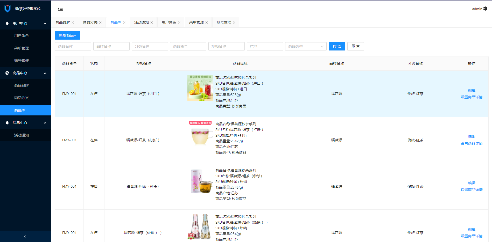

## 纯前端  develop分支
## 前后端交互 master分支

1. yarn install
2. yarn serve

3.服务端启动参照：[https://gitee.com/ZHANG_6666/express--vue3--ant-design2](https://gitee.com/ZHANG_6666/express--vue3--ant-design2)

4.账号：admin ,密码:zb123456

5.界面

6.商品预览端

