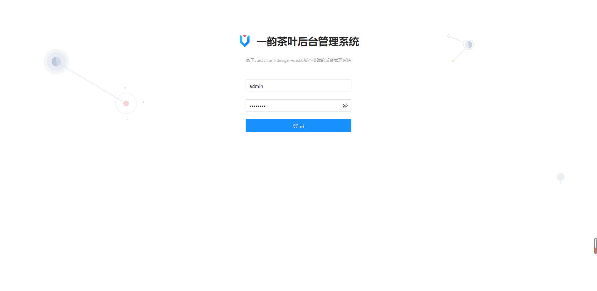
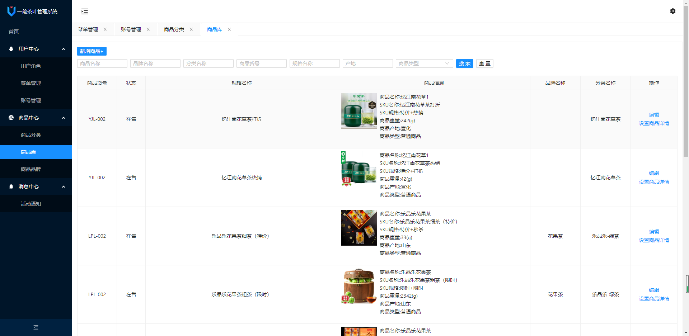
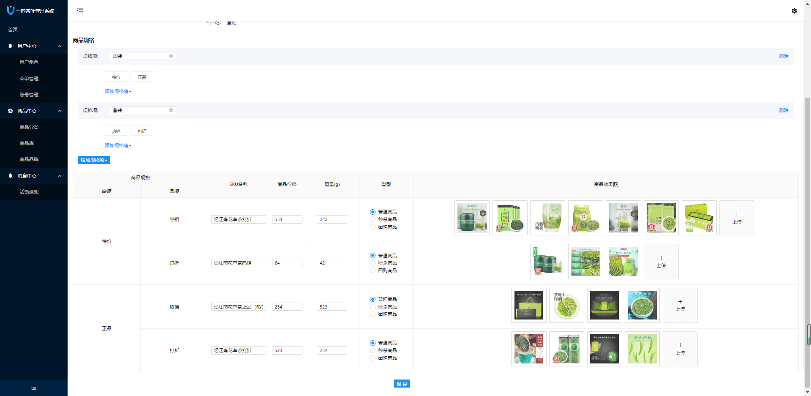
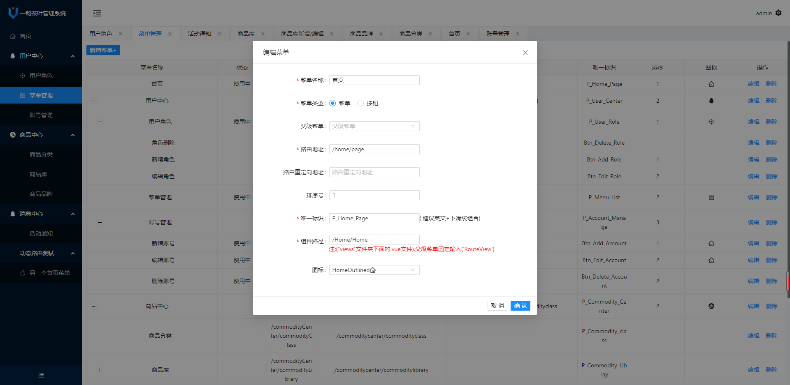
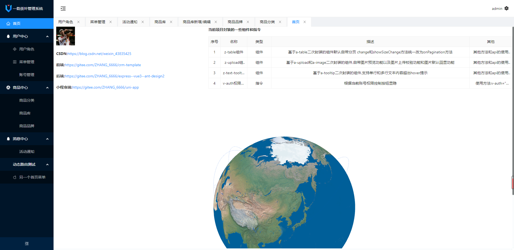
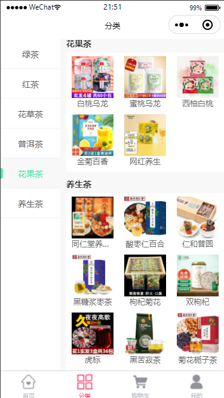

## 纯前端  develop分支
## 前后端交互 master分支

##### 1. yarn install
##### 2. yarn serve

##### 3.服务端启动参照：[https://github.com/zhangbo126/express-mongoose-server](https://github.com/zhangbo126/express-mongoose-server)

##### 4.账号：admin ,密码:zb123456

##### 5.界面

##### 6.小程序端预览端

### 7.其他
根据业务场景封装了部分组件,详细内容介绍在项目首页查看

